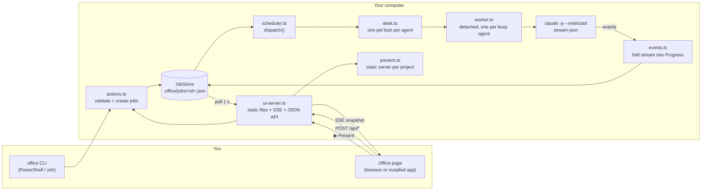
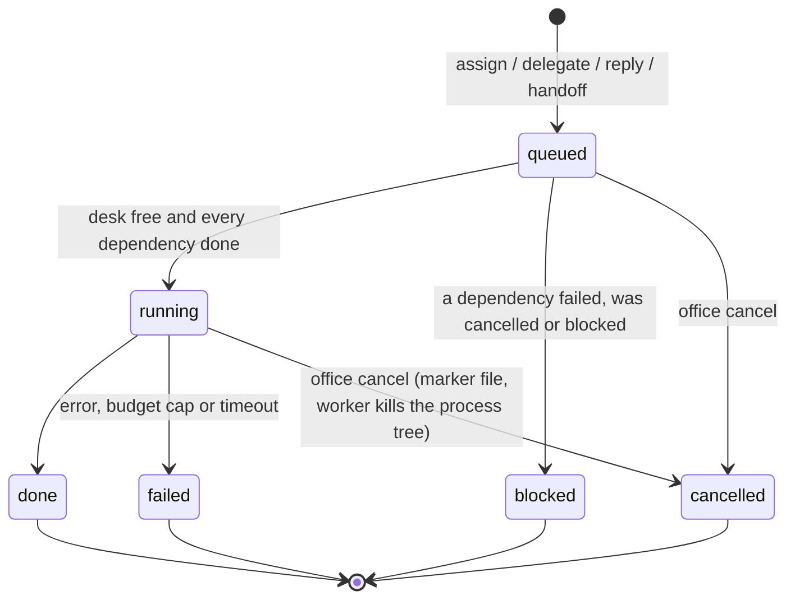
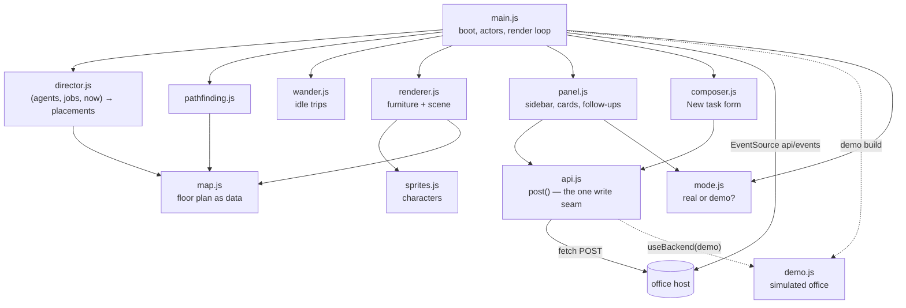

# Architecture

5CR1PT3R5 is a small Node.js program with no runtime dependencies. It runs a team of Claude Code agents as separate processes and shows them in a pixel-art office in the browser. This page explains how the parts fit together and why they're built that way.

## The big picture



There's **no daemon.** Everything goes through the job files:

1. The CLI or the page asks [`actions.ts`](src/actions.ts) to assign, delegate, reply or cancel. Both use the same functions, so input is validated the same way.
2. The action writes a job to [`JobStore`](src/store.ts), one JSON file per job, written atomically (temp file + rename).
3. [`dispatch()`](src/scheduler.ts) settles job states and starts a detached [worker](src/worker.ts) for every agent that has runnable work and a free desk.
4. The worker claims the agent's [desk](src/desk.ts) (a pid lock file), runs [`claude -p`](src/claude.ts) in the task folder, and folds the event stream into the job's `progress` with the pure reducers in [`events.ts`](src/events.ts).
5. When its queue is empty, the worker releases the desk, checks the queue one more time to close the race with a job assigned while it was finishing, then exits. An idle agent costs nothing.

Any terminal can read the state at any time, because it's just files. If the host crashes, nothing is lost. Desk locks left by dead workers are detected by pid and taken over.

## A job's life



- **One job at a time per agent.** The desk lock guarantees it, and an agent's queue runs oldest first.
- **Dependencies** (`--after`, a delegated plan, or Ava's handoff) start a job only when everything before it is `done`. If an upstream job fails, its dependents become `blocked`, transitively.
- **Cancellation** crosses process boundaries, so it uses a marker file instead of writing the job (only one process writes a job at a time). The worker sees the marker and kills the whole process tree ([`proc.ts`](src/proc.ts)).
- **Follow-ups** (`office reply`) resume the same Claude session in the same folder, so the agent keeps its context and doesn't pay to re-read the project.

## Delegation

[`delegate.ts`](src/delegate.ts) gives a big request to Ava (the Tech Lead) in one of two ways:

| | `office delegate` (*Ava decides*) | `office assign ava "…"` |
|---|---|---|
| What Ava does | Only plans | Does her own part first (architecture, scaffolding, interfaces) |
| How the plan comes back | One tool-free Opus call with structured JSON output, about $0.05 | She writes `HANDOFF.json` in her folder |
| What happens next | Subtasks queued at once | Subtasks queued when her job finishes |

Both use the same plan format, validated by `parsePlan`: real agent ids, and dependencies that only point backwards. Subtasks share one project folder and run in parallel wherever the plan allows. When a project has a UI, Priya (frontend) goes first and saves the design system to `design-system/<project>/MASTER.md`. The others follow it.

## Cost control

| Lever | Where |
|---|---|
| Each role defaults to the cheapest model that does it well | [`roster.ts`](src/roster.ts) |
| Planning is one tool-free call; cheaper models do the work | [`delegate.ts`](src/delegate.ts) |
| Agents load no skills, no MCP servers, only their role's tools; personas are short | [`claude.ts`](src/claude.ts), [`roster.ts`](src/roster.ts) |
| The design database is reached through a CLI wrapper, not a loaded skill | [`design-search.ts`](src/design-search.ts) |
| Hard spend cap per job (`--max-budget-usd`) | [`roster.ts`](src/roster.ts) |
| Replies resume the session | [`worker.ts`](src/worker.ts) |

## The office page

The page in [`web/`](web/) is plain ES modules with JSDoc types. It has no framework and no bundler, and it's type-checked by the same `tsc` run as the server.



- **Pure core, thin shell.** [`director.js`](web/js/director.js) decides where every agent sits and what their bubble says as a pure function of `(agents, jobs, now)`. [`map.js`](web/js/map.js) is pure data, and [`pathfinding.js`](web/js/pathfinding.js) is plain BFS. All three are unit-tested, including a check that every seat can be reached on foot.
- **Art is separate from logic.** Redesign the floor in `map.js`, swap the characters in `sprites.js`, or restyle furniture in the `DRAW` table in `renderer.js`.
- **Accessible.** Everything on the canvas is also in the sidebar as text and buttons. Job changes are announced to screen readers, and reduced-motion users get no walking or wandering.
- **Safe text.** Task text and reports are inserted as text nodes, never as HTML.

### Installable app (PWA)

- [`manifest.webmanifest`](web/manifest.webmanifest) and the icons let Chrome, Edge, Safari (iOS: *Add to Home Screen*) and Android install the page as a standalone app. No Electron and no app store.
- [`sw.js`](web/sw.js) is a **network-first** service worker. Edits to `web/` show up on the next load, and the cached shell is only a fallback, so the app opens offline and says it can't reach the office. Live data under `api/` is never cached, so an offline app never shows stale jobs as current.
- All page URLs are relative, so the same files work at `/` on the host and under `/5CR1PT3R5/` on GitHub Pages.

### The demo build

The public demo runs the same page with a simulated office instead of the host:

```
npm run build:demo  →  dist/demo/
  web/ copied as is
  index.html        <html data-mode="demo" data-repo="…">
  demo-roster.json  generated from src/roster.ts, so the team never drifts
```

[`demo.js`](web/js/demo.js) plays the server's part through the two seams the page already had: `useBackend()` answers what `post()` would send, and its snapshots replace the SSE stream. It follows the real scheduler's rules (one job per agent, dependencies, Ava's fan-out) with scripted steps. An autopilot keeps the floor busy, and the visitor can assign, delegate, follow up and stop jobs. It has no DOM and no timers, since the page calls `tick(now)`, so [`test/demo.test.ts`](test/demo.test.ts) can run an afternoon of office time in milliseconds.

[`.github/workflows/pages.yml`](.github/workflows/pages.yml) type-checks, tests and builds it on every push to `main`, then deploys it to GitHub Pages.

## Tests

```sh
npm run check   # tsc --noEmit + node:test
```

Pure modules (events, director, map, pathfinding, wander, demo, plan parsing) are tested directly. The store, scheduler, desk, script runner and Present are tested against real temp folders and processes. The UI server's security checks (static paths, `isTrustedWrite`) have their own cases. See [CONTRIBUTING.md](CONTRIBUTING.md).

## Why it's built this way

| Decision | Reason |
|---|---|
| No daemon; one JSON file per job | Any terminal can read state; a crash loses nothing; easy to inspect |
| Detached worker per busy agent | Agents work in parallel; idle agents cost nothing |
| TypeScript run directly by Node (type stripping) | No build step, no `dist/` to forget to rebuild |
| No runtime dependencies | Nothing to audit or update but Node itself |
| Plain ES modules for the page | No bundler; the page you edit is the page that runs |
| PWA instead of Electron or React Native | One codebase, about 30 KB of icons and manifest, installs on every platform. The agents need the local host anyway |
| Demo simulated in the browser | A public portfolio piece with no server, no cost, and nothing of yours exposed |
